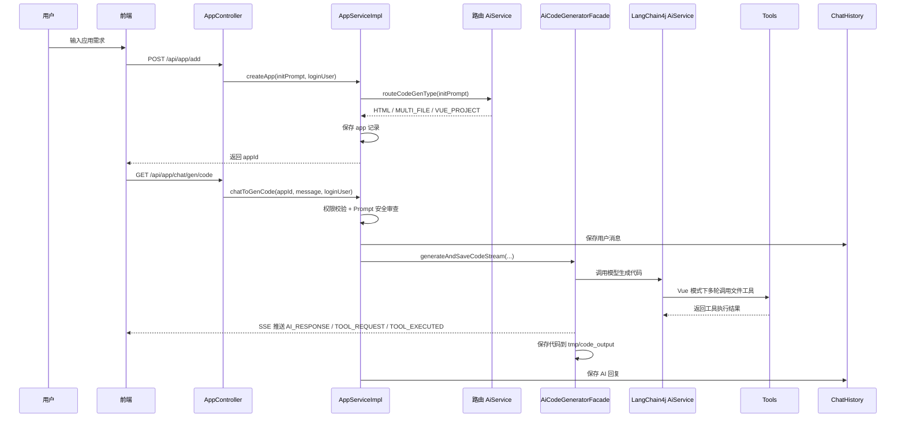
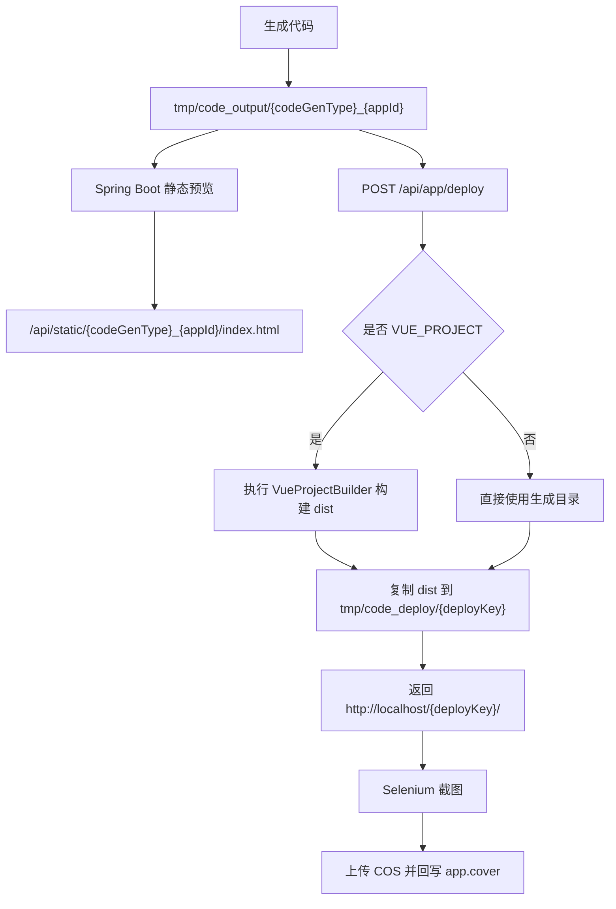

# Pormpt Forge

Pormpt Forge 是一个基于 Spring Boot 3 和 LangChain4j 的 AI 零代码应用生成后端服务。用户输入应用需求后，系统会创建应用记录，自动判断代码生成类型，并通过 SSE 流式接口驱动大模型生成 HTML、多文件原生项目或 Vue 工程项目。生成后的代码会落盘到本地目录，支持在线预览、构建部署、封面截图、源码打包下载和对话历史追踪。

当前仓库主要是 Java 后端服务，前端通过 HTTP API、SSE 和静态资源预览地址与后端交互。

## 项目亮点

- AI 代码生成：支持 `HTML`、`MULTI_FILE`、`VUE_PROJECT` 三种生成模式，由路由模型根据初始化需求自动选择。
- 流式生成体验：使用 Server-Sent Events 返回生成过程，前端可以实时展示模型输出、工具请求和工具执行结果。
- Vue 工程工具调用：Vue 模式下通过 LangChain4j `TokenStream` 和工具调用完成文件读写、目录读取、文件修改、图片素材搜索和任务退出。
- 对话记忆管理：MySQL 持久化用户和 AI 对话历史，Redis 作为 LangChain4j ChatMemory Store，并实现长会话摘要压缩。
- Prompt 安全护轨：在业务入口和 AiService 层拦截明显的提示词注入、越狱和超长输入，并记录被拦截 prompt。
- 应用管理闭环：包含应用创建、查询、更新、删除、精选应用、管理员管理、生成历史和源码下载。
- 部署与封面：Vue 项目会执行 npm 构建，部署后复制到本地部署目录，并使用 Selenium 截图上传到腾讯云 COS 作为封面。
- 后端基础设施：集成 Spring Session Redis、Spring Cache、Caffeine、Redisson 分布式限流、AOP 权限校验和 Knife4j 接口文档。
- 工作流实验：保留 LangGraph4j 节点式工作流代码，用于探索素材收集、提示词增强、代码生成、质量检查和构建流程；当前主业务链路仍以 LangChain4j AiService 为核心。

## 技术栈

| 分类 | 技术 |
| --- | --- |
| 后端框架 | Java 21、Spring Boot 3.5.4、Spring MVC、Spring AOP |
| 数据访问 | MySQL、MyBatis-Flex、HikariCP |
| 缓存和会话 | Redis、Spring Session Data Redis、Spring Cache、Caffeine |
| AI 开发 | LangChain4j、OpenAI Compatible API、DashScope、LangGraph4j |
| 流式响应 | Reactor `Flux`、Server-Sent Events |
| 工具调用 | LangChain4j Tools、自定义文件工具、图片搜索工具 |
| 限流 | Redisson `RRateLimiter` |
| 文件处理 | Hutool、项目压缩下载、本地静态资源映射 |
| 截图和存储 | Selenium、WebDriverManager、腾讯云 COS |
| 接口文档 | Knife4j、Springdoc OpenAPI |

## 核心业务流程



## 生成、预览和部署



说明：

- 预览路径由 `StaticResourceController` 提供，读取 `tmp/code_output`。
- 部署路径读取 `tmp/code_deploy`，默认部署访问域名为 `http://localhost/{deployKey}/`，通常需要配合 Nginx 或本地静态服务映射。
- 当前代码中部署接口要求应用创建者操作，并且应用需要是精选应用，即 `priority = 99`。

## 项目结构

```text
src/main/java/com/max/aicoder
├── ai                  # LangChain4j AiService、模型路由、上下文压缩、护轨、工具调用
├── annotation          # 权限校验注解
├── aop                 # 权限拦截切面
├── common              # 通用响应、分页、删除请求
├── config              # CORS、Redis、模型、COS、JSON 等配置
├── constant            # 用户、应用常量
├── controller          # HTTP API 控制层
├── core                # 代码生成门面、解析、保存、流处理、Vue 构建
├── exception           # 业务异常和全局异常处理
├── langgraph4j         # LangGraph4j 工作流实验代码
├── manager             # 第三方服务封装，例如 COS
├── mapper              # MyBatis-Flex Mapper
├── model               # Entity、DTO、VO、Enum
├── ratelimiter         # Redisson 分布式限流注解和切面
├── service             # 业务接口和实现
└── utils               # 截图、缓存 Key、Spring 上下文工具
```

```text
src/main/resources
├── application.yml                 # 默认配置，激活 local profile
├── application-local.yml            # 本地敏感配置，已被 .gitignore 忽略
├── mapper                           # MyBatis XML
└── prompt                           # 代码生成、路由、质检、素材收集等系统提示词
```

## 本地启动

### 环境要求

- JDK 21
- MySQL 8.x
- Redis 6.x 或更高版本
- Node.js 和 npm，Vue 工程生成、构建和部署时需要
- Maven，可直接使用仓库自带 `./mvnw`

### 初始化数据库

```bash
mysql -uroot -p < sql/create_table.sql
```

脚本会创建 `ai_coder` 数据库，并初始化以下表：

| 表 | 说明 |
| --- | --- |
| `user` | 用户账号、角色和资料 |
| `app` | 应用信息、生成类型、部署标识、封面 |
| `chat_history` | 用户和 AI 对话历史 |
| `prompt_block_log` | 被安全审查拦截的 prompt 记录 |

### 配置本地密钥

项目默认激活 `local` profile，敏感信息建议写入 `src/main/resources/application-local.yml`。该文件已在 `.gitignore` 中忽略，不要提交真实密钥。

最小配置示例：

```yaml
spring:
  datasource:
    password: your_mysql_password
  data:
    redis:
      password:
      database: 8

langchain4j:
  open-ai:
    chat-model:
      api-key: your_dashscope_or_openai_compatible_key
    streaming-chat-model:
      api-key: your_dashscope_or_openai_compatible_key
    reasoning-streaming-chat-model:
      api-key: your_dashscope_or_openai_compatible_key
    routing-chat-model:
      api-key: your_dashscope_or_openai_compatible_key

compress:
  chat-model:
    api-key: your_dashscope_or_openai_compatible_key

cos:
  client:
    secretId: your_cos_secret_id
    secretKey: your_cos_secret_key

dashscope:
  api-key: your_dashscope_api_key

pexels:
  api-key: your_pexels_api_key
```

默认服务端口和上下文路径来自 `application.yml`：

```text
http://localhost:8234/api
```

### 启动服务

```bash
./mvnw spring-boot:run
```

启动后可访问：

| 地址 | 说明 |
| --- | --- |
| `GET http://localhost:8234/api/health/` | 健康检查 |
| `http://localhost:8234/api/doc.html` | Knife4j 接口文档 |

## 常用接口

| 接口 | 方法 | 说明 |
| --- | --- | --- |
| `/api/user/register` | POST | 用户注册 |
| `/api/user/login` | POST | 用户登录 |
| `/api/user/get/login` | GET | 获取当前登录用户 |
| `/api/app/add` | POST | 创建应用并选择代码生成类型 |
| `/api/app/chat/gen/code` | GET | SSE 流式生成代码 |
| `/api/app/my/list/page/vo` | POST | 分页获取当前用户应用 |
| `/api/app/good/list/page/vo` | POST | 分页获取精选应用，带缓存 |
| `/api/app/deploy` | POST | 部署应用并异步生成封面 |
| `/api/app/download/{appId}` | GET | 下载生成项目源码 ZIP |
| `/api/chatHistory/app/{appId}` | GET | 游标分页查询应用对话历史 |
| `/api/static/{dir}/**` | GET | 预览生成代码静态资源 |

## 代码生成模式

| 类型 | 说明 | 主要实现 |
| --- | --- | --- |
| `html` | 生成单文件 HTML 页面 | `AiCodeGeneratorService.generateHtmlCodeStream`、`HtmlCodeParser`、`HtmlCodeFileSaverTemplate` |
| `multi_file` | 生成原生多文件项目 | `generateMultiFileCodeStream`、`MultiFileCodeParser`、`MultiFileCodeFileSaverTemplate` |
| `vue_project` | 通过工具调用生成完整 Vue 工程 | `generateVueProjectCodeStream`、`TokenStream`、`ToolManager`、`VueProjectBuilder` |

Vue 工程模式的工具包括：

| 工具 | 作用 |
| --- | --- |
| `FileWriteTool` | 写入项目文件 |
| `FileReadTool` | 读取文件内容 |
| `FileModifyTool` | 修改已有文件 |
| `FileDirReadTool` | 读取目录结构 |
| `FileDeleteTool` | 删除文件 |
| `ContentImageSearchTool` | 搜索内容图片素材 |
| `IllustrationSearchTool` | 搜索插画素材 |
| `ExitTool` | 通知模型结束工具调用流程 |

## 本地文件目录

运行过程中会产生以下本地目录：

| 目录 | 说明 |
| --- | --- |
| `tmp/code_output` | AI 生成代码的保存目录，也是 Spring Boot 预览读取目录 |
| `tmp/code_deploy` | 应用部署目录，默认用于 `http://localhost/{deployKey}/` 静态访问 |
| `target` | Maven 构建产物 |

这些目录属于运行产物，不建议提交到 Git。

## 构建和验证

```bash
./mvnw test
./mvnw package -DskipTests
```

如果只想确认编译是否通过，可以执行：

```bash
./mvnw -DskipTests package
```

## 设计边界

- 当前仓库是后端服务，不包含完整前端工程。
- 主生成链路是 `AppController -> AppServiceImpl -> AiCodeGeneratorFacade -> LangChain4j AiService / TokenStream -> 工具调用 -> 文件生成`。
- LangGraph4j 代码目前更适合作为工作流实验和后续扩展方向，不应描述成当前所有请求都会经过的主链路。
- `application-local.yml`、模型密钥、COS 密钥和本地生成目录不要提交到远程仓库。
